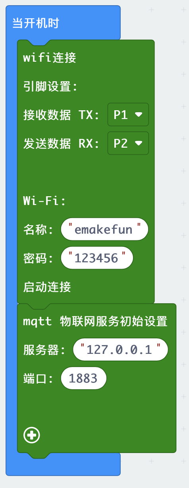
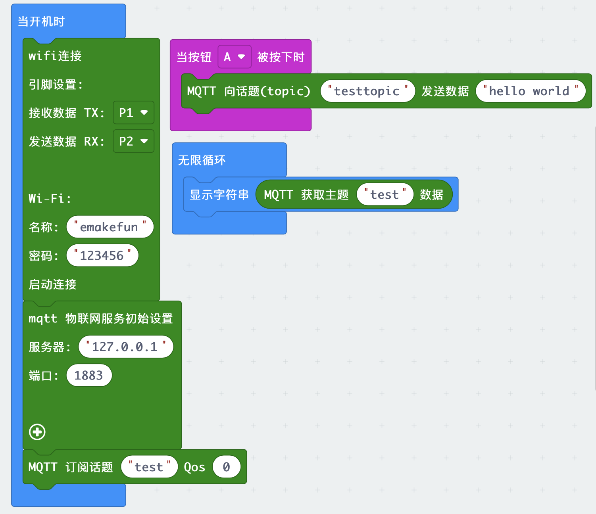
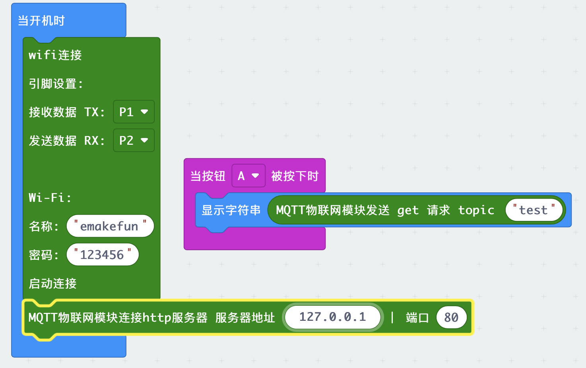

# EMmqtt
[English](README.md) 中文版

esp8266-mqtt无线模块是emakefun公司基于乐鑫科技的wifi芯片ESP8266基础上重新研发的串口转wifi的物联网模块，该模块采用AT配置方式来支持wifi无线通信，AT指令全面兼容[乐鑫官方指令库（V3.0.0）](https://www.espressif.com/sites/default/files/documentation/4a-esp8266_at_instruction_set_cn.pdf)，在此基础上添加了MQTT指令，并且全部封装成scratch，mixly，Makecode图形化编程块支持arduino，micro:bit。让用户非常容易接收和发送物联网信息，远程物联网控制从未如此简单。

## 硬件参数

- 工作电压：5V
- 接口速率：9600 bps
- 无线频率：2.4GHz
- 接口类型：PH2.0-4Pin (G V TX TX)
- 无线模式：IEEE802.11b/g/n
- SRAM：160KB
- 外置Flash：4MB
- 支持低功耗：<240mA
- 模块尺寸：4 * 2.1cm
- 安装方式：M4螺钉螺母固定

## 模块特点：

- 内置低功率 32 位 CPU：可以兼作应用处理器
- 内置协议：TCP/IP 协议栈
- 加密类型：WPA WPA2/WPA2–PSK
- 支持乐鑫官方AT标准指令集
- 支持连接标准MQTT协议和TTL串口到无线的应用

## MQTT扩展AT指令

### AT+MQTTUSERCFG - 配置 MQTT 用户属性
设置指令:
AT+MQTTUSERCFG=<LinkID>,<scheme>,<"client_id">,<"username">,<"password">,<cert_key_ID>,<CA_ID>,<"path">

功能:
设置 MQTT 用户配置

响应:

OK或ERROR

参数说明:

LinkID: 当前只支持 0
scheme:
1: MQTT over TCP
2: MQTT over TLS(no certificate verify)
3: MQTT over TLS(verify server certificate)
4: MQTT over TLS(provide client certificate)
5: MQTT over TLS(verify server certificate and provide client certificate)
6: MQTT over WebSocket(based on TCP)
7: MQTT over WebSocket Secure(based on TLS, no certificate verify)
8: MQTT over WebSocket Secure(based on TLS, verify server certificate)
9: MQTT over WebSocket Secure(based on TLS, provide client certificate)
10: MQTT over WebSocket Secure(based on TLS, verify server certificate and provide client certificate)
client_id: 对应 MQTT client ID, 用于标志 client 身份, 最长 256 字节
username: 用于登录 MQTT broker 的 username, 最长 64 字节
password: 用于登录 MQTT broker 的 password, 最长 64 字节
cert_key_ID: 证书 ID, 目前支持一套 cert 证书, 参数为 0
CA_ID: CA ID, 目前支持一套 CA 证书, 参数为 0
path: 资源路径, 最长 32 字节

### AT+MQTTCLIENTID - 配置 MQTT 客户端 ID
设置指令:

AT+MQTTCLIENTID=<LinkID><"client_id">

功能:
设置 MQTT 客户端 ID, 将会覆盖 AT+MQTTUSERCFG 中 clientID 参数,
用户可通过 AT+MQTTCLIENTID 设置较长的 clientID.

响应:

OK或ERROR

参数说明:

LinkID: 当前只支持 0
client_id: 对应 MQTT client ID, 用于标志 client 身份, 最长 256 字节

### AT+MQTTUSERNAME - 配置 MQTT 登录用户名
设置指令:

AT+MQTTUSERNAME=<LinkID><"username">

功能:
设置 MQTT 登录用户名, 将会覆盖 AT+MQTTUSERCFG 中 username 参数,
用户可通过 AT+MQTTUSERNAME 设置较长的用户名.

响应:

OK或ERROR

参数说明:

LinkID: 当前只支持 0
username: 对应 MQTT username, 用于登录 MQTT broker, 最长 256 字节

### AT+MQTTPASSWORD - 配置 MQTT 登录密码
设置指令:

AT+MQTTPASSWORD=<LinkID><"password">

功能:
设置 MQTT 登录密码, 将会覆盖 AT+MQTTUSERCFG 中 password 参数,
用户可通过 AT+MQTTPASSWORD 设置较长的密码.

响应:

OK或ERROR

参数说明:

LinkID: 当前只支持 0
password: 对应 MQTT password, 用于登录 MQTT broker, 最长 256 字节

### AT+MQTTCONNCFG - 配置 MQTT 连接属性
设置指令:

AT+MQTTCONNCFG=<LinkID>,<keepalive>,<disable_clean_session>,<"lwt_topic">,<"lwt_msg">,<lwt_qos>,<lwt_retain>

功能:
设置 MQTT 连接配置

响应:

OK或ERROR

参数说明:

LinkID: 当前只支持 0
keepalive: MQTT PING 超时时间,范围为 [60, 7200], 单位为秒. 默认 120
disable_clean_session: MQTT 清理会话标志, 参数为 0 或 1, 默认为 0
lwt_topic: 遗嘱 topic, 最长 64 字节
lwt_msg: 遗嘱 message, 最长 64 字节
lwt_qos: 遗嘱 QoS, 参数可选 0, 1, 2, 默认为 0
lwt_retain: 遗嘱 retain, 参数可选 0, 1, 默认为 0

### AT+MQTTCONN
设置指令:

AT+MQTTCONN=<LinkID>,<"host">,<port>,<reconnect>

功能:
连接指定 MQTT broker

响应:

OK或ERROR

查询指令:

### AT+MQTTCONN?

功能:
查询 AT 已连接的 MQTT broker

响应:

AT+MQTTCONN:<LinkID>,<state>,<scheme><"host">,<port>,<"path">,<reconnect>

参数说明:

LinkID: 当前只支持 0
host: 连接 MQTT broker 域名, 最大 128 字节
port: 连接 MQTT broker 端口, 最大 65535
path: 资源路径, 最长 32 字节
reconnect: 是否重连 MQTT, 若设置为 1, 需要消耗较多内存资源
state: MQTT 当前状态, 状态说明如下:
0: 连接未初始化
1: 已设置 MQTTUSERCFG
2: 已设置 MQTTCONNCFG
3: 连接已断开
4: 已建立连接
5: 已连接, 但未订阅 topic
6: 已连接, 已订阅过 topic
scheme:
1: MQTT over TCP
2: MQTT over TLS(no certificate verify)
3: MQTT over TLS(verify server certificate)
4: MQTT over TLS(provide client certificate)
5: MQTT over TLS(verify server certificate and provide client certificate)
6: MQTT over WebSocket(based on TCP)
7: MQTT over WebSocket Secure(based on TLS, no certificate verify)
8: MQTT over WebSocket Secure(based on TLS, verify server certificate)
9: MQTT over WebSocket Secure(based on TLS, provide client certificate)
10: MQTT over WebSocket Secure(based on TLS, verify server certificate and provide client certificate)

### AT+MQTTPUB
设置指令:

AT+MQTTPUB=<LinkID>,<"topic">,<"data">,<qos>,<retain>

功能:
在 LinkID上通过 topic 发布数据 data, 其中 data 为字符串消息, 若要发布二进制,请使用 AT+MQTTPUBRAW

响应:

OK或ERROR

参数说明:

LinkID: 当前只支持 0
topic: 发布主题, 最长 64 字节
data: 发布消息, data 不能包含 \0, 请确保整条 AT+MQTTPUB 不超过 AT 指令的最大长度限制
qos: 发布服务质量, 参数可选 0,1,2, 默认为 0
retain: 发布 retain

### AT+MQTTPUBRAW
设置指令:

AT+MQTTPUBRAW=<LinkID>,<"topic">,<length>,<qos>,<retain>

功能:
在 LinkID 上通过 topic 发布数据 data, 其中 data 为二进制数据

响应:

OK或ERROR

等待用户输入 length 大小数据, 之后响应如下:

+MQTTPUB:FAIL

或

+MQTTPUB:OK

参数说明:

LinkID: 当前只支持 0
topic: 发布主题, 最长 64 字节
length: 要发布消息长度, 长度受限于当前可用内存
qos: 发布服务质量, 参数可选 0,1,2, 默认为 0
retain: 发布 retain
AT port 未收到指定 length 长度的数据, 将一直等待, 在此期间接收到的数据都会当成普通数据

### AT+MQTTSUB
设置指令:

AT+MQTTSUB=<LinkID>,<"topic">,<qos>

功能:
订阅指定连接的 MQTT 主题, 可重复多次订阅不同 topic

响应:

OK或ERROR

当收到对应主题订阅的 MQTT 消息时, 将按照如下格式打印消息内容

+MQTTSUBRECV:<LinkID>,<"topic">,<data_length>,data

如果订阅已订阅过的主题, 仍无条件向 MQTT broker 订阅, Log 口打印 ALREADY SUBSCRIBE

查询指令:

### AT+MQTTSUB?

### 功能:
查询 MQTT 所有连接上已订阅的 topic

响应:

+MQTTSUB:<LinkID>,<state>,<"topic1">,<qos>
+MQTTSUB:<LinkID>,<state>,<"topic2">,<qos>
+MQTTSUB:<LinkID>,<state>,<"topic3">,<qos>
...
OK
1
2
3
4
5
或ERROR

参数说明:

LinkID: 当前只支持 0
state: MQTT 当前状态, 状态说明如下:
0: 连接未初始化
1: 已设置 MQTTUSERCFG
2: 已设置 MQTTCONNCFG
3: 连接已断开
4: 已建立连接
5: 已连接, 但未订阅 topic
6: 已连接, 已订阅过 topic
topic*: 订阅过的主题
qos: 订阅过的 QoS

### AT+MQTTUNSUB
设置指令:

AT+MQTTUNSUB=<LinkID>,<"topic">

功能:
取消订阅指定连接的 MQTT 主题, 可多次取消不同订阅 topic

响应:

OK或ERROR

参数说明:

LinkID: 当前只支持 0
topic: 取消订阅主题, 最长 64 字节
如果取消未订阅的主题, 仍无条件向 MQTT broker 取消订阅, Log 口打印 NO UNSUBSCRIBE

### AT+MQTTCLEAN
设置指令:

AT+MQTTCLEAN=<LinkID>

功能:
关闭 MQTT Client 为 LinkID 的连接, 并释放内部占用的资源

响应:

OK或者ERROR

参数说明:

LinkID: 当前只支持 0

### microbit makecode块
- 初始化设置块

 在初始化设置块中，首先要设置TX(发送)和RX(接收)端口引脚,然后是设置模块需要连接的wifi账号和密码，初始化还需要设置自己mqtt服务器的ip和端口（默认为1883），同时点击➕可以设置其他信息。

- 消息订阅块

消息订阅快是用来订阅主题然后设置消息接受的模块，其topic后输入你想订阅的主题名称，后面的Qos为你订阅消息传输设置。
当输入数字为0时: 服务器发送的一条消息，用户最多能收到一次，也就是说服务器力向用户发送消息，如果发送失败，也就算了；
当输入数字为1时: 服务器发送的一条消息，用户至少能收到一次，也就是说服务器向用户发送消息，如果发送失败，会继续重试，直到用户收到消息为止，但是因为重传的原因，用户有可能会收到重复的消息；
当输入数字为2时: 服务器发送的一条消息，用户确保能收到而且只收到一次，也就是说服务器尽力向用户发送消息，如果发送失败，会继续重试，直到用户收到消息为止，同时保证用户不会因为消息重传而收到重复的消息。
  
- 消息发送块
  

向用户发为主题的发送内容，输入你需要以哪个主题推送消息和消息内容。

- 消息接收块
  

接收你所订阅的某个主题推送过来的消息。

- http模式配置块
  

设置http服务器的域名（或IP）和端口，默认80。

- http模式get请求块
  

发送get请求。

### mqtt模式演示

     解释：mqtt物联网模块设置P1，P2引脚为发送接收引脚，设置Wi-Fi配置，连接Wi-Fi；连接mqtt服务器，端口为1883，之后订阅主题“test”，并设置至少能接受到一次消息，当按下microbit A键之后，向主题“testtopic”推送消息"hello world"，同时也接收来自主题“test”推送过来的数据，并在microbit上显示出来。

### http模式演示

     解释：mqtt物联网模块设置P1，P2引脚为发送接收引脚，设置Wi-Fi配置，连接Wi-Fi；连接http服务器，端口为80，当按下microbit A键之后，mqtt模块发送get请求“test”,并且把接收到的请求数据在microbit点阵屏上显示。
